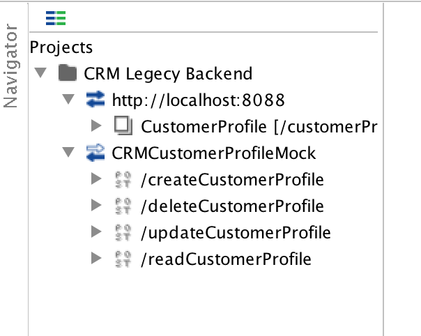
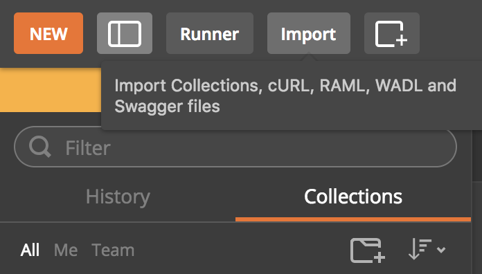

# Customer Profile API (spring-boot)

This project is an application for customer profile management API using Java, Spring Boot.

## Getting Started

### Prerequisites
* Git
* JDK 8
* Maven 3.0 or later
* SOAPUI 5 or later

### Clone
To get started you can simply clone this repository using git:
```
git clone https://github.com/KalpaD/customer.git
cd customer
```

### High level architecture document.
This is located at root level in work fromat `High_level_architecture.docx`

It includes the security architecture which will be used to support web and mobile clients.


### Configuration
In order to get the customer service working you have set up following:

###### A set of mock services to simulate CRM back end.

1. Copy the CRM-Legecy-Backend-soapui-project.xml file to convenient location and open it using SOAPUI
    
2. Open the mock service window by double clicking on CRMCustomerProfileMock
    
3. And run it.

4. The default mock port is 8089, Please change that if you have any port conflict.

The configuration is located in `src/resources/application.yml`.
It contains the endpoint configurations which use by the API to communicate to these mock.
If you change the port please make sure to the port in `application.yml`

### Build an executable JAR
You can run the application from the command line using:
```
mvn spring-boot:run
```
Or you can build a single executable JAR file that contains all the necessary dependencies, classes, and resources with:
```
mvn clean package
```
Then you can run the JAR file with:
```
java -jar target/*.jar
```

### Testing customer endpoints.

1. Import `customer-tech-test.postman_collection` to postman.
    
2. You can use thi collection to invoke the customer resources.


### Unit and integration test report.

Once you build the project successfully, you can find the Jacoco test report at
```
/target/site/jacoco/index.html`
```


